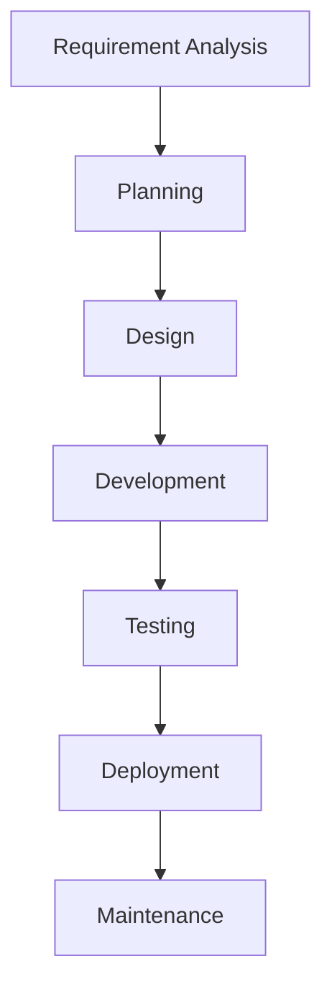

# Number Sorter 
The **Number Sorter** is a simple web-based mini project built using **HTML, CSS, and JavaScript**.  
It allows users to input numbers separated by spaces, choose a sorting algorithm, and view:
- Original numbers
- Sorted numbers
- Frequency of each number


This project demonstrates basic **sorting algorithms**, **DOM manipulation**, and **JavaScript logic**.

## Features
- Accepts space-separated numbers
- Supports multiple sorting algorithms:
  - Bubble Sort
  - Quick Sort
  - Selection Sort
  - Insertion Sort
- Displays original and sorted arrays
- Shows frequency of each number
- Reset functionality


## Project Structure

```
project-folder/
│
├── index.html
├── style.css
├── js-functions.js
├── bubble-sort.js
├── quick-sort.js
├── selection-sort.js
├── insertion-sort.js
└── README.md
```

## Technologies Used
- HTML5
- CSS3
- JavaScript (ES6)

### SDLC




### USE Case Diagram


### Activity Diagram


### Sequence Diagram


## How It Works
1. User enters numbers separated by spaces.
2. User selects a sorting algorithm.
3. On clicking **Sort Numbers**:
   - Input is converted to an array of integers.
   - Selected sorting algorithm is applied.
   - Frequency of numbers is calculated.
4. Results are displayed on the screen.


## How to Run
1. Download or clone the project.
2. Open `index.html` in any modern web browser.
3. Enter numbers and click **Sort Numbers**.


### Thank you for Visiting..
